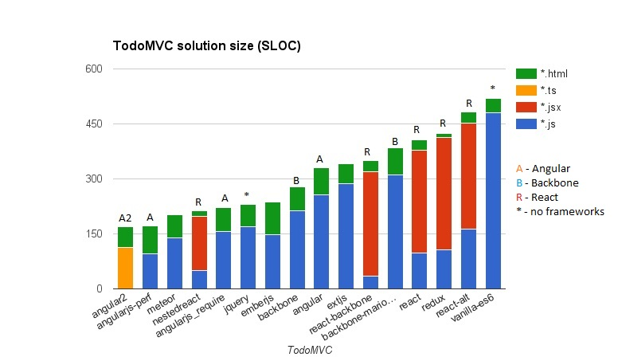

# NestedReact • [TodoMVC](http://todomvc.com)

This TodoMVC application is written to demonstrate how powerful and expressive declarative OO data layer can be in React.

It features pure unidirectional data flow (which is common for Flux applications) achieved with conventional OO design
technique.

## Comparison and Analysis

Solution appears to be much shorter than other React solutions,
and is on par with Angular, Ember, Meteor, and framework-free jquery solution.



So, let's dig into details and understand why it's so different. No, it's not because we are using telegraph coding style,
putting everything in a single LOC. :) It's something more interesting.

### JSX is twice smaller than usual

So, how could that be? Because, we're doing something significantly different from commonly known React technique:

1. We're using [smart React Links](https://github.com/Volicon/NestedReact#two-way-data-binding) for [two-way data binding](/docs/databinding.md).
2. Due to (1), we are able to describe the most of UI with fast and lightweight [components defined as stateless functions](https://facebook.github.io/react/docs/reusable-components.html#stateless-functions), introduced in React 0.14.

These two techniques in combination will save you half of the work in JSX, and make it look much cleaner.
Remember - the best code is the code you avoided to write. :) 

Since our links are framework-neutral and available as [separate dependency-free package](https://github.com/Volicon/valuelink),
any React system can benefit from this style. You might wonder how it looks like.
Typically, like this:


### JS (data layer) is 2-3 times smaller

The reason it's shorter is that it's _not_ flux, _nor_ something strange and immutable. But [_classical mutable models_](https://github.com/Volicon/NestedTypes). Thus, it takes the same size as in Backbone, Angular, Ember, etc. 

But it's not _that_ naive and simple mutable models you dealt with before. They kinda smart enough to _give you features you could expect from flux_:

- Unidirectional data flow.
- ["Pure render"](https://github.com/Volicon/NestedReact#props-specs-and-pure-render-optimization) optimization.

Not to mention, that they are [very fast](http://slides.com/vladbalin/performance#/). NestedReact uses [NestedTypes]([https://github.com/Volicon/NestedTypes]) model framework, which is designed to handle collections of 10-50K elements smoothly, and in general all operations are order of magnitude (10x) faster than backbone.

The more complex application will become, the more noticeable this difference in size will be.
Reason is that in NestedTypes case the data layer is mostly defined with declarative spec.
All you have to do, is to describe the structure of your data,
and use our smart Links to [bind it to UI](/docs/databinding.md).
And it will work this way 90% of the time, [no matter, how complex your data are](https://github.com/Volicon/NestedTypes/blob/master/docs/RelationsGuide.md).

## Resources

- [NestedReact docs](https://github.com/Volicon/NestedReact)
- [Post-backbone models](https://github.com/Volicon/NestedTypes): 10x more performance, type safety, aggregation and relations right out of box. 
- [Used by](http://www.volicon.com/)

##FAQ
### How can you do pure render with mutable models? I heard it's impossible.

By comparing object's versions. For _immutable_ data, reference to the data itself can be used as version token, it's the same thing. For _mutable_ data, you need to introduce separate version token, so we do it. Let's understand how this mechanics works.

Every NestedTypes model and collection has `_changeToken` property, which contains empty object `{}` reassigned every time object is updated (and {} !== {}, they are separate objects allocated on heap). Inside of `shouldComponentUpdate`, we compare these version tokens for every model and collection listed in `props` with tokens used at last render. Thus, we're able to efficiently check whenever model or collection was changed since the last render.

It works faster than any generic PureRenderMixin because we dynamically compile `shouldComponentUpdate` functions with _loops unrolled_, taking props list from component's `propTypes` (loops through hashes are very expensive, as well as `Object.keys` call).

Why it might be better than just deal with immutable data?
Because it doesn't force you to build all the system around an 
idea that JS is some bad-looking dialect of Haskell. You might have some
old UI code you want to reuse, and mutable models are clearly beneficial in this case.

Therefore, you can have circular references, and permanent references to objects in data layer with no problems.
You may safely pass nested models and collection around. As you most likely get used to.

### How unidirectional data flow can work?

Because our models and collections can be nested, and parents detects nested changes. So, when you put something complex to the top-level component state, the state (which itself is the model in our case) will notice any changes happend deep inside, and triggers UI update.

There's another example illustrating that, which is a bit simpler - [flux-comparison](https://github.com/Volicon/NestedReact/tree/master/examples/flux-comparison).

### What are that `props` and `state` in component definitions?

It's type specs. In its simplest form, it describe object's shape with pairs `name : Constructor`, or `name : <primitive value>`. Like this:

```javascript
state : {
  s1 : String,
  s2 : 'asasa', // same as String.value( 'asasa' ) 
  m  : Model
}
```

`props` spec is being compiled to `propTypes`, while `state` spec is used to create [NestedTypes model](http://volicon.github.io/NestedTypes/#nested.model) which will serve instead of standard `this.state`.

Refer to [NestedTypes API Reference](http://volicon.github.io/NestedTypes/#attribute-types) for complete type annotation syntax.

### What does `editing : ToDo.from( '^props.todos' )` from `todolist.jsx` mean?

This is NestedTypes type annotation, which literally means "`editing` is the model of `ToDo` type which is taken from 
collection in my parent's (`^`) `props.todos` property". In case of React component's `state` definition, 
'parent' is the React component holding the state, so `^props.todos` refers to its props. 

In NestedReact, component's state is managed with NestedTypes model, and being defined declaratively using 
attribute type specs. So, every state member becomes model attribute, which may have complex type like another
 model or collection. While it's nice by itself to have declarative spec for state, it gives you a lot more. NestedTypes observes and detects all
changes in nested model and collection tree, and triggers UI update for you automatically. For you, it mostly looks as if
   you'd work with plain objects.

Models in attributes can be _aggregated_ (thus they are inherent part of the model, and that what would happen if you just state `ToDo`
in the example above), or referenced with _relation_ (so, they are taken from some other collection). In the second case,
you add `ModelType.from( path )` for to-one relation, and `CollectionType.subsetOf( path )` for to-many relation.  

`path` in `Model.from( path )` - is the simple dot-separated path to property taken relative to model `this`. `^` is the 
shortcut for `getOwner()`, thus `^props.todos` is being translated to `this.getOwner().props.todos`.

Relation differs to aggregation in many aspects, for example:
 - relations are being serialized as referenced model ids, not as nested JSON.
 - relations are always shallow copied, even if owner is deep copied.
 - deep changes in referenced models doesn't trigger attribute's holder change.

Relations is one of the most powerful NestedTypes features. For more information, please 
check [NestedTypes Relations Guide](https://github.com/Volicon/NestedTypes/blob/master/docs/RelationsGuide.md)

## Credit

Created by Vlad Balin & [Volicon](http://www.volicon.com/)
